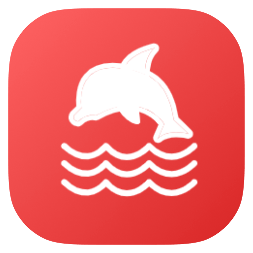

<h1>
  CodeVar
  
</h1>

CodeVar is a variable naming tool for [Raycast](https://www.raycast.com/) extensions powered by YouDao translate api.

Based on the git repository changes at [https://github.com/ifyour/code-var](https://github.com/ifyour/code-var)

### Usage

To use CodeVar, follow these steps:

```bash
# Clone the repository by running the following command in your terminal:
git clone https://github.com/wingsheep/code-var.git

# Navigate to the cloned repository by running the following command:
cd code-var

# Start the development server by running the following command:
npm i && npm run dev
```

### Screenshot

Call up Raycast and search for CodeVar. Input the variable you want to translate, and press `Enter` to copy it to the clipboard. Alternatively, you can press `Cmd` + `Enter` to copy and paste it.


In addition, you can carry a parameter that can be used to query multiple results in a specified format

```ts
/** The type of query alias */
export enum CASES_ALIAS  {
  "xt" = "camelCase",
  "dt" = "pascalCase",
  "cl" = "constantCase",
  "xh" = "snakeCase",
}
```


 Enjoy using CodeVar!

### License

CodeVar is licensed under the MIT License.
